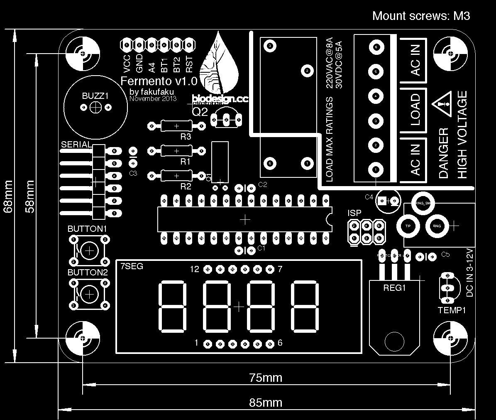

Fermento
========

An open-source incubator for fun and profit. For more information about the project, see [biodesign.cc](http://biodesign.cc/2013/12/25/diy-incubator/).

Board
-----

* __Fab__ contains the PCB version to send to a professional PCB fabrication house. It has a nice silkscreen and slightly better component layout. 
* __Homebrew__ contains the version for homebrew PCB printing. The layout is one-sided for easier manufacturing. Drill plan and assembly instruction sheet included.
  To accomodate a single sided board, the wiring of the component to the microcontroller had to be changed. The correct pin mapping can be changed by a single line
  in the firmware.

Bill Of Material
----------------

* 1x ATmega328p
* 1x DIP28 socket 
* 2x Tactile switch (through hole) (BUTTON1, BUTTON2) (C&K PTS645SM95-2 LFS)
* 2x Resistor 10K (R1, R3)
* 1x Resistor 1K (R2)
* 4x Capacitor 0.1uF, 2.5 mm pin spacing (C1, C2, C3, C5)
* 1x Electrolytic capacitor 47uF, radial, 2.5 mm pin spacing (C4)
* 1x 6-pin 90-degrees header (SERIAL)
* 1x 3x2-pin straight header (ISP)
* 1x 6-terminal screw block (Altech MBE-156)
* 1x Relay, 3VDC switching (Omron G6RL-1A-DC3)
* 1x 13mm buzzer (BUZZ1) (Murata, PKM13EPYH4000-A0)
* 1x DC jack 2.1mm (Kobiconn 163-179PH-EX)
* 1x 32.768kHz crystal (Q1) (ECS-.327-12.5-13X)
* 1x Mosfet transistor, TO92 (Q2) (Supertex TP2104N3-G)
* 1x 3.3V Regulator, TO220 (REG1) (TI TLV2217-33KCSE3)
* 1x Temperature sensor, TO92 (TEMP1) (TI LM61CIZ/NOPB)
* 1x 7-segment 4-digit display (7SEG) (Lumex LDQ-N514RI)

Wiring of the incubator
-----------------------

The board has a 6 pin terminal that allows minimal effort in wiring all the AC part of the circuit.

* The 2 wires from the bulb socket go into __LOAD__.
* The 2 wires from the plug go into one of the __AC IN__ terminal.
* The second __AC IN__ can be used to attach a female AC socket. This allows to connect there a DC outlet to power the board.

Power supply
------------

The board has a 2.1mm DC jack. The DC regulator requires an input of 3-12V DC.

Firmware
--------

To install the firmware in your Arduino IDE, do the following.

* Copy the folder `firmware/Fermento` to your local Arduino folder.
* Copy the content of `firmware/hardware` to local `Arduino/hardware`.
* Copy the content of `firmware/libraries` to local `Arduino/libraries`.

Then, chose `Tools -> Board -> ATmega328p on a breadboard`. Choose the sketch
`Fermento` from the sketchbook, and upload it.

In case you don't use the homebrew version, there is one line to comment out in
the sketch to change the pin mapping.

In the Fab version, an ISP header is provided to burn the bootloader. The Homebrew
version is lacking this, so a different board (such as the standard Arduino) needs
to be used to burn the bootloader. In addition, an ISP-programmer is needed.
An Arduino board can also be used to do [the job](http://arduino.cc/en/Tutorial/ArduinoISP).

Use it
------

Button1 and button2 control the incubation temperature and time respectively.

When button1 is shortly pressed the display switches to temperature. To set the
incubation temperature, keep button1 pressed until it displays the desired
temperature. The temperature regulation starts as soon as an incubation
temperatures different than 0 is set. Note that if the incubation temperature
is lower than room temperature, nothing happens.

When button2 is shortly pressed the display switches to incubation time
(hours:minutes). To set the incubation time, keep button2 pressed until the
desired incubation time is displayed. If you don’t set an incubation time, the
incubation will never stop. The time goes up in increments of 30 minutes.

Pressing button1 and button2 together for a few seconds resets incubation temperature and time to 0.

License
-------

2013 (c) Robin Scheibler, [CC BY-SA 3.0](https://creativecommons.org/licenses/by-sa/3.0/).

Based on [TokyoTime](http://robinscheibler.org/TokyoTime), itself based on SparkFun's [BigTime](https://www.sparkfun.com/products/11734).

The code uses the [Arduino PID library](http://playground.arduino.cc/Code/PIDLibrary).

